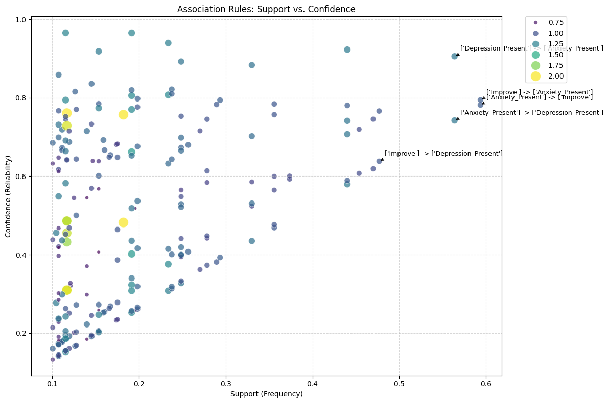

# Association Rule Mining on Music Listening Habits and Mental Health Indicators
**CSC173 Intelligent Systems Final Project**  
*Mindanao State University - Iligan Institute of Technology*  
**Student:** Febe Gwyn R. Belvis, 2022-0380 
**Semester:**  AY 2025-2026 Sem 1

## Abstract

## Table of Contents
- [Introduction](#introduction)
- [Related Work](#related-work)
- [Methodology](#methodology)
- [Experiments & Results](#experiments--results)
- [Discussion](#discussion)
- [Ethical Considerations](#ethical-considerations)
- [Conclusion](#conclusion)
- [Installation](#installation)
- [References](#references)

## Introduction
### Problem Statement
Music is deeply involved and engrained in our lives, especially in our emotional regulation, stress levels, and well-being. However, most studies rely on correlations or predictive modls with respect to music and mental well-being rather than examining co-occuring patterns of listening behaviors, musical preferences, and mental health indicators. Therefore, this project seeks to observe which combinations of music generes, habits, and emotional states commonly occur together and see if such paterns can reveal meaningful associations about how us, individuals, use music to reflect on our mental health.

### Objectives
- Transform the MxMH survey records into a transactional-style dataset which will be used for apriori rule mining.
- Identify frequent itemsets representing common combinations of music genres, havits, and mental health levels.
- Generate association rules and evaluate their strength using the following metrics: support, cinfidence, lift, conviction, and leverage.
- Visualize insights from the rules and interpret the associations.

## Related Work
- De Filippis, R., & Foysal, A. A. (2025). Associations between Music Listening Habits and Mental Health: A Cross-Sectional Analysis. OALib, 12(04), 1–29. https://doi.org/10.4236/oalib.1113196
- Dong, X., Kang, X., & Ding, X. (2022). Influence and analysis of music teaching environment monitoring on students’ mental health using data mining technology. Journal of Environmental and Public Health, 2022(1), 1120156. https://doi.org/10.1155/2022/1120156

(GAPS: Most accessible papers only explores either ARM on mental health or ARM on music and not on both)

## Methodology
### Dataset
- Source: Kaggle Music X Mental Health Survey
- Shape: 736 Rows - 33 Columns
- Preprocessing:
    - Excluded columns/features that introduces high cardinality
    - Filled missing values in `Music effects` with its mode
    - Binned `Hours per day`
    - Reduce `Fave genre` to 12 + `Other`

### Apriori Algorithm and Values

| Parameter | Value |
|-----------|-------|
| `min_support` (for frequent items) | 0.1 |
| Support (`min_threshold`) | 0.05 |
| Confidence (`min_threshold`) | 0.5 |
| Lift (`min_threshold`) | 1.2 |
| Leverage (`min_threshold`) | 0.02 |
| Conviction (`min_threshold`) | 1.2 |

### Implementation Code Snippet
`frequent_items = apriori(df_onehot, min_support=0.1, use_colnames=True, max_len=5)`

`rules = association_rules(frequent_items, metric="support", min_threshold=0.05)
support_rules = rules.sort_values('support', ascending=False)`

`[display_cols].head(10)`

## Experiments & Results
### Metrics
| Metric | Top Rule | Value | Total # of Rules |
|-------|---------|--------|--------|
| Support | {Anxiety_Present} $\leftrightarrow$ {Improve} | 0.593750 (59%) | 230 |
| Confidence | {Rock, Improve, Depression_Present} $\rightarrow$ {Anxiety_Present} | 0.965909 (97%) | 112 |
| Lift | {Anxiety_Absent, Improve} $\leftrightarrow$ {Depression_Absent} | 2.014898 | 38 |
| Leverage | {Depression_Absent} $\leftrightarrow$ {Anxiety_Absent} | 0.091228 | 62 |
| Conviction | {Rock, Improve, Depression_Present} $\rightarrow$ {Anxiety_Present} | 7.054348 | 50 |

### Demo
[Video: [CSC173_Belvis_Final.mp4](demo/CSC173_Belvis_Final.mp4)] [web:41]

## Discussion
- Strengths: Decently tells us about the correlation and co-occurence of some mental health variables (anxiety and depression) and the most common favorite music genre (rock)

- Limitations: Very high dimensionality of dataset after preprocessing and one-hot encoding.

- Insights: 
    - Pruned itemsets with support below 0.1 or 1%. 
    - Excluded low power columns/high cardinality features
    - Binned some numerical features to reduce categories

## Ethical Considerations
- Privacy: Mental health variables (e.g., anxiety, depression, insomnia, OCD) are sensitive personal data, even if it is self-reported and anonymized. There's a reidentification risk when the mental health attributes are combined with values such as age, streaming platform, and music preferences especially with roles like composer and/or instrumentalist.
- Contextual Inegrity: The respondents may not have explicitly agreed to take the survey and allow their responses to be used in contexts beyond data analysis or statistics.
- Finally, because we're dealing with associations between music genres and mental health variables, there's also a risk of stigmatization. Meaning, due to co-occurences and evident associations, readers may label certain genres as unhealthy or depressing even though the data reported in this context is not diagnostic.

## Conclusion
Apriori Association Rule Mining has been successfully applied to the Music x Mental Health Survey Dataset, uncovering patterns in listening habits and self-reported mental health. The preprocessing phase (which includes high-cardinality pruning and binning of values) mitigated data sparsity, enabling us to extract 62 frequent itemsets (support > 1%). A key finding in this project is that the dominant profile in the dataset is the 'Anxious Improver', with nearly 60% of respondents reporting both Anxiety and mental health improvement driven by music.

To expand upon the findings of this project,  future works may focus on transitioning from descriptive analysis to real-time application. Additionally, this project suggests to integrate the rules with audio feature analysis to initiate the creation of hybrid music recommendation system that is capable of suggesting tracks 'scientifically' proven to co-occur with positive mental well-being for distinct user profiles.

## Installation
1. Clone repo: `git clone https://github.com/bbeecue/CSC172-AssociationMining-Belvis`
2. Install deps: `pip install -r requirements.txt`
3. Run notebook (1) `exploration_preprocessing.ipynb` then (2) `apriori_implementation.ipynb`

**requirements.txt:**
pandas
numpy
matplotlib
mlxtend
scikit-learn
seaborn

## References
[1] Dong, X., Kang, X., & Ding, X. (2022). Influence and analysis of music teaching environment monitoring on students’ mental health using data mining technology. Journal of Environmental and Public Health, 2022(1), 1120156. https://doi.org/10.1155/2022/1120156

[2] https://statisticsbyjim.com/graphs/pareto-charts/

## GitHub Pages
View this project site: [https://bbeecue.github.io/CSC172-AssociationMining-Belvis/](https://bbeecue.github.io/CSC172-AssociationMining-Belvis/) [web:32]
