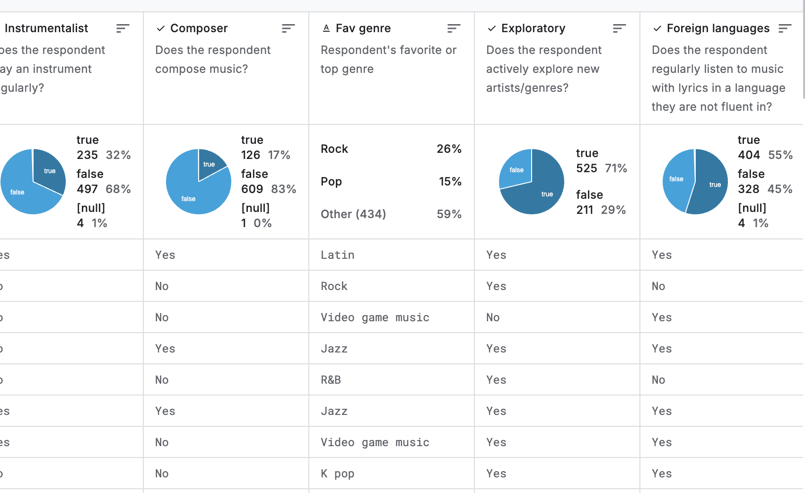

# CSC172 Association Rule Mining Project
**Student:** Febe Gwyn R. Belvis, 2022-0390
**Date:** December 13, 2025  
**Repository:** [https://github.com/bbeecue/CSC172-AssociationMining-Belvis](https://github.com/bbeecue/CSC172-AssociationMining-Belvis)  
**Commits Since Proposal:** 3 | **Last Commit:** December 13, 2025 (5:16 PM)

## 📊 Current Status
| Milestone | Status | Notes |
|-----------|--------|-------|
| Exploratory Data Analysis | ✅ Done | Finalized columns to include and binning strategy |
| Preprocessing| ✅ Done | Binned Numerical Values + Transformed genre frequency to one-hot encoding |
| Association Rule Mining Implementation | ⏳ Not Started | Planned for Dec 14 |
| Rule Filtering & Evaluation | ⏳ Not Started | Planned for Dec 15|
| Interpretation and Visualization | ⏳ Not Started | Planned for Dec 15

## 1. Dataset Progress
-- to be edited

**Sample data preview:**

## 2. ARM Implementation Progress
To be implemented

## 3. Challenges Encountered & Solutions (TO BE EDITED)
| Issue | Status | Resolution |
|-------|--------|------------|

| Class imbalance | ⏳ Ongoing | Added class weights to loss function |

## 4. Next Steps [TO BE EDITED] (Before Final Submission) 
- [ ] Complete training (50 more epochs)
